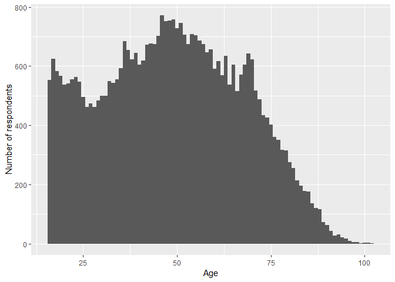
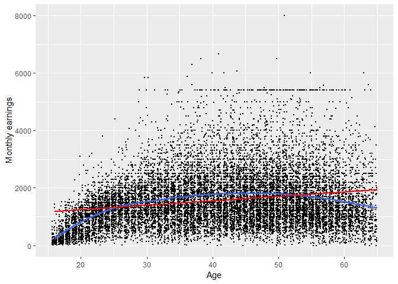
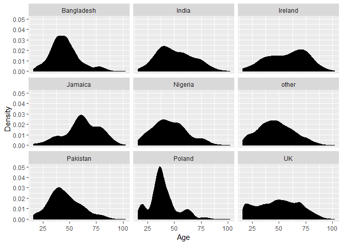
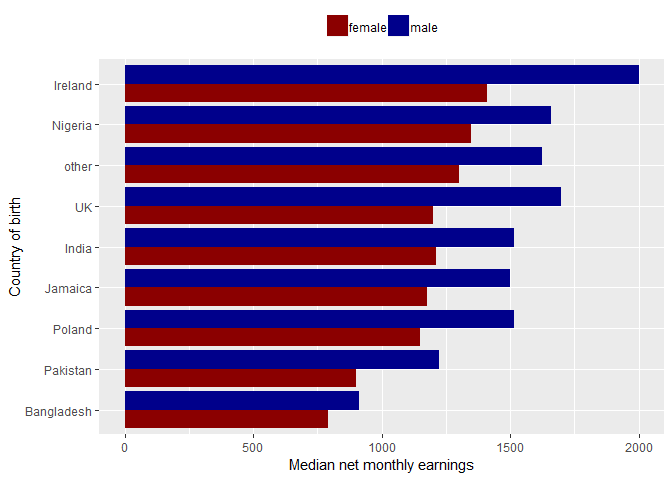
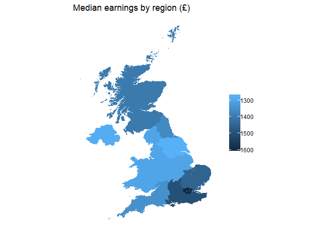

Statistical assignment 4
================
Alicia Rey-Herme (014989)
4 March 2019

In this assignment you will need to reproduce 5 ggplot graphs. I supply graphs as images; you need to write the ggplot2 code to reproduce them and knit and submit a Markdown document with the reproduced graphs (as well as your .Rmd file).

First we will need to open and recode the data. I supply the code for this; you only need to change the file paths.

``` r
# Install tidyverse and data.table packages
library(tidyverse)
library(data.table)

# Load in data and select variables (dplyr::)
Data8 <- fread("C:/Users/alici/Documents/DA3/data/SN6614/tab/ukhls_w8/h_indresp.tab")
Data8 <- Data8 %>%
        dplyr::select(pidp, h_age_dv, h_payn_dv, h_gor_dv)
Stable <- fread("C:/Users/alici/Documents/DA3/data/SN6614/tab/ukhls_wx/xwavedat.tab")
Stable <- Stable %>%
        dplyr::select(pidp, sex_dv, ukborn, plbornc)

# Join data
Data <- Data8 %>% left_join(Stable, "pidp")
rm(Data8, Stable)

# Recode data
Data <- Data %>%
        mutate(sex_dv = ifelse(sex_dv == 1, "male",
                           ifelse(sex_dv == 2, "female", NA))) %>%
        mutate(h_payn_dv = ifelse(h_payn_dv < 0, NA, h_payn_dv)) %>%
        mutate(h_gor_dv = recode(h_gor_dv,
                         `-9` = NA_character_,
                         `1` = "North East (England)",
                         `2` = "North West (England)",
                         `3` = "Yorkshire and The Humber",
                         `4` = "East Midlands (England)",
                         `5` = "West Midlands (England)",
                         `6` = "East of England",
                         `7` = "London",
                         `8` = "South East (England)",
                         `9` = "South West (England)",
                         `10` = "Wales",
                         `11` = "Scotland",
                         `12` = "Northern Ireland")) %>%
        mutate(placeBorn = case_when(
                ukborn  == -9 ~ NA_character_,
                ukborn < 5 ~ "UK",
                plbornc == 5 ~ "Ireland",
                plbornc == 18 ~ "India",
                plbornc == 19 ~ "Pakistan",
                plbornc == 20 ~ "Bangladesh",
                plbornc == 10 ~ "Poland",
                plbornc == 27 ~ "Jamaica",
                plbornc == 24 ~ "Nigeria",
                TRUE ~ "other")
        )
```

Reproduce the following graphs as close as you can. For each graph, write two sentences (not more!) describing its main message.

(Note the position of the code chunks; each is preceded by four spaces. This helps display numbered lists correctly in the Markdown file with the output.)

#### 1. Histogram (20 points)

``` r
# Plot histogram of Age
Data %>%
  ggplot(aes(x = h_age_dv)) +
  # Customise number of bins
  geom_histogram(bins = 87) +
  # Add axis labels
  xlab("Age") +
  ylab("Number of respondents")
```



The histogram of respondent's ages show a wide spread of ages from ages 16 to above 100, with a dip in respondents between roughly ages 25 to 30, and a gradual decrease in frequency after the most frequent age of around 50, creating an upper tail in the dataset. The shape of this histogram shares a strong likeness to the general UK age demography graphs.

#### 2. Scatter plot (20 points). The red line shows a linear fit; the blue line shows a quadratic fit. Note the size and position of points.

``` r
# Plot scatterplot of monthly earnings vs age    
Data %>%
  ggplot(aes(x = h_age_dv, y = h_payn_dv)) +
  # Customise scatterpoints
  geom_point(position = position_jitter(width = NULL, height = NULL), size = 0.5) +
  # Add x axis limit
  xlim(NA, 65) +
  # Add in regression lines
  geom_smooth() +
  geom_smooth(method='lm', formula=y~x, col = 'red') +
  # Add axis labels
  xlab("Age") +
  ylab("Monthly earnings")
```



The red regression line suggests that there is a generally positive correlation between monthly earnings and age, however the curved line of regression suggests that respondents in their senior years earned less than middle-aged counterparts. At all ages there is a large variation of monthly earnings, with outliers majorly lying on the upper end of earnings rather than the lower.

#### 3. Faceted density chart (20 points).

``` r
# Plot faceted density chart  of age distributions by country of birth 
Data %>%
  # Remove NAs for country of birth
  filter(!is.na(placeBorn)) %>%
  # Plot
  ggplot(aes(x = h_age_dv)) +
  # Change aesthetics
  geom_density(fill = "black") +
  facet_wrap(~ placeBorn, ncol = 3) +
  # Add axis labels
  xlab("Age") +
  ylab("Density") 
```



These plots, showing the spread of ages based on country of birth, may show evidence of different generations of immigration. Whilst the UK is relatively flat (Reflective of the general UK age demographics), Ireland and Jamaica have spikes at senior ages which could suggest an influx of immigration for that generation (Either as seniors, or as youths 30-50 years ago), whilst others (Most notably Poland and Bangladesh) have spikes of people at working ages, which could suggest recent immigration of youth and working age people.

#### 4. Ordered bar chart of summary statistics (20 points).

``` r
# List the countries in the same order     
Data$placeBorn <- factor(Data$placeBorn, levels = c("Bangladesh", "Pakistan", "Poland", "Jamaica", "India", "UK", "other", "Nigeria", "Ireland"))

# Plot bar graph    
Data %>%
  filter(!is.na(sex_dv) & !is.na(placeBorn)) %>%
  group_by(sex_dv, placeBorn) %>%
  summarise(medianEarnings = median(h_payn_dv, na.rm = TRUE)) %>%
  ggplot(aes(x = placeBorn, y = medianEarnings, fill = sex_dv, reorde)) +
  geom_bar(position = "dodge", stat="identity") +
  scale_fill_manual(values = c("dark red","dark blue")) +
  theme(legend.position = "top", legend.title = element_blank()) +
  xlab("Country of birth") +
  ylab("Median net monthly earnings") +
  coord_flip()
```



For all country of origins listed, women consistently have a lower median net monthly earnings than men. Respondents born in Ireland have the highest median net monthly earnings (Although the median for Irish females is still lower than men of Nigerian, "other", UK, Indian, Jamaican, and Polish origins), whilst those of Bangladeshi origin earn the least.

#### 5. Map (20 points). This is the most difficult problem in this set. You will need to use the NUTS Level 1 shape file (available here -- <https://data.gov.uk/dataset/2aa6727d-c5f0-462a-a367-904c750bbb34/nuts-level-1-january-2018-full-clipped-boundaries-in-the-united-kingdom>) and a number of packages for producing maps from shape files. You will need to google additional information; there are multiple webpages with the code that produces similar maps.

``` r
# Install necessary packages
library(rgdal)
library(mapdata)
library(ggmap)
library(broom)

# Read in the shape file.
area <- readOGR(dsn = "C:/Users/alici/Documents/DA3/assignment4/template", layer = "NUTS_Level_1_January_2018_Full_Clipped_Boundaries_in_the_United_Kingdom")
```

    ## OGR data source with driver: ESRI Shapefile 
    ## Source: "C:\Users\alici\Documents\DA3\assignment4\template", layer: "NUTS_Level_1_January_2018_Full_Clipped_Boundaries_in_the_United_Kingdom"
    ## with 12 features
    ## It has 9 fields
    ## Integer64 fields read as strings:  objectid bng_e bng_n

``` r
# Tide the shapefile
map <- tidy(area, region = "nuts118nm")

# Calculate medians of each region
basedata <- Data %>%
  filter(!is.na(h_gor_dv)) %>%
  group_by(h_gor_dv) %>%
  summarise(MedEarningsRegion = median(h_payn_dv, na.rm = TRUE))
colnames(basedata)[1] <- "id"

# Merge shapefile and median data
mapdata <- merge(map, basedata, by="id")

# Plot the map
mapplot <- ggplot() + geom_polygon(data = mapdata, aes(x = long, y = lat, group = group, fill = MedEarningsRegion), size = 0.25) +
            # Reverse the scale colouring
            scale_fill_continuous(trans = "reverse") +
            # Change proportions of the map
            coord_fixed(1.4) +
            # Remove axis, background, and legend title of the graph
            theme(axis.line=element_blank(),
                  axis.text.x=element_blank(),
                  axis.text.y=element_blank(),
                  axis.ticks=element_blank(),
                  axis.title.x=element_blank(),
                  axis.title.y=element_blank(),
                  panel.background=element_blank(),
                  panel.border=element_blank(),
                  panel.grid.major=element_blank(),
                  panel.grid.minor=element_blank(),
                  plot.background=element_blank(),
                  legend.title = element_blank()) +
            # Add title
            ggtitle("Median earnings by region (£)")
mapplot
```



The map shows that the London respondents have the highest median earnings, followed by its neighbouring regions, with the lowest earnings in the West Midlands and Northern Ireland. Aside from Scotland and North East of England which have higher median earnings than their neighbours, there seems to be a trend that regions further from London and more Northern have lower median earnings.
